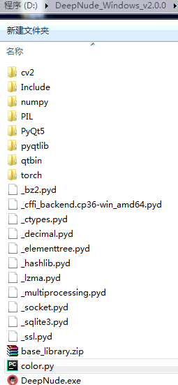
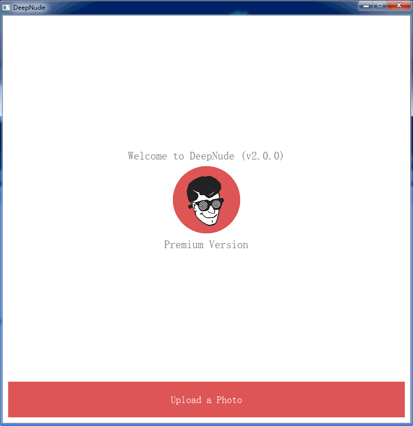
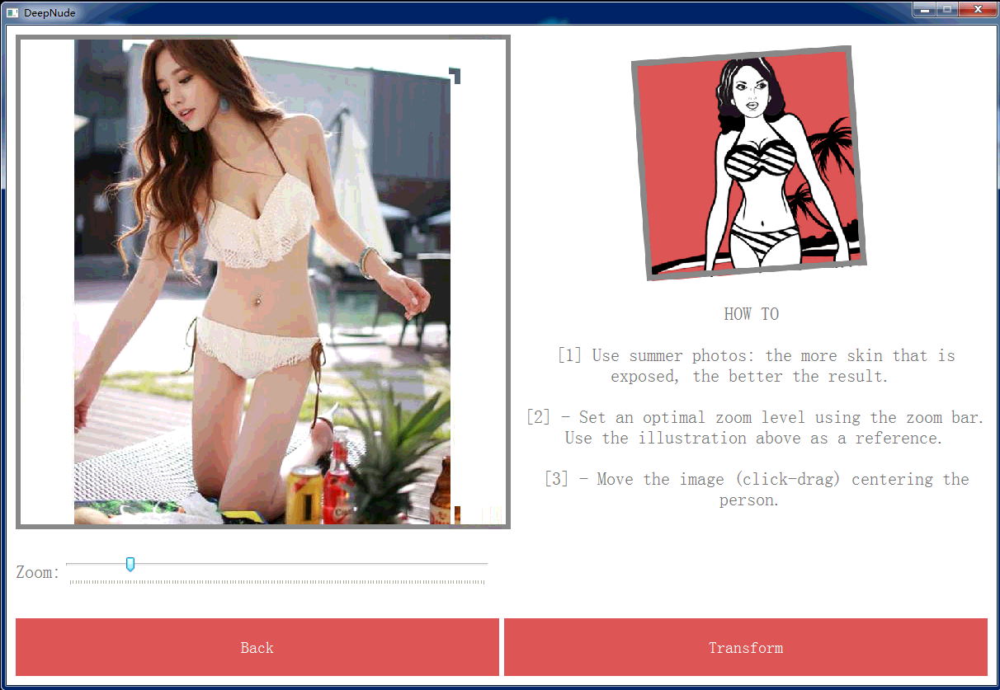
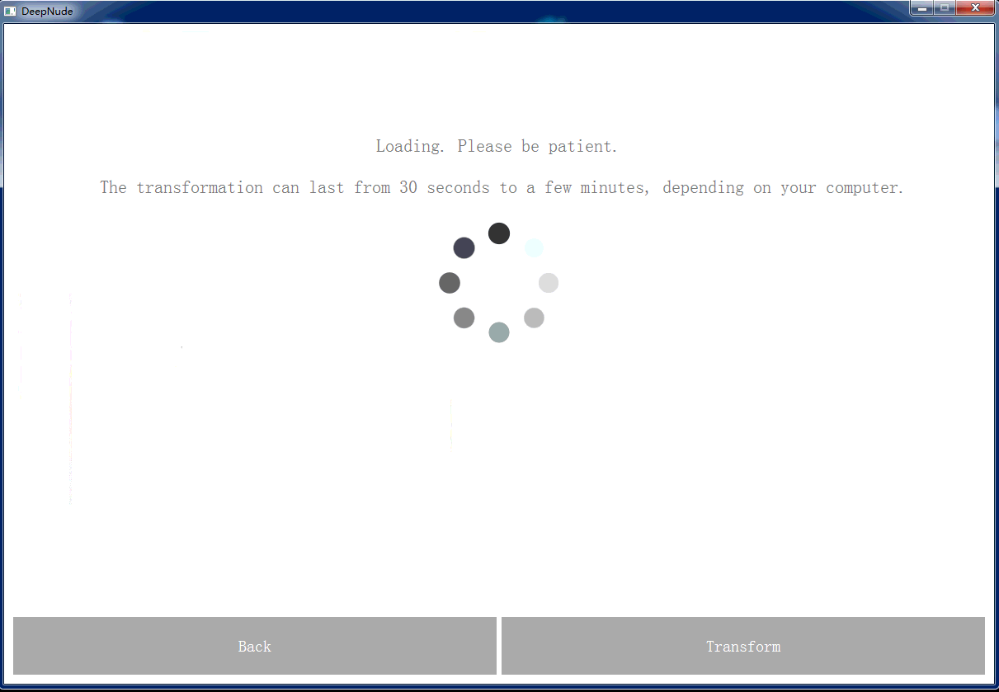
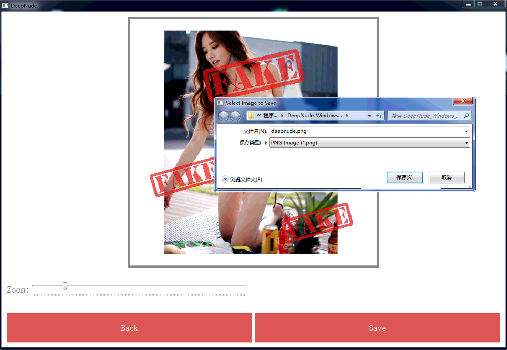

## DeepNude software itself

After researching DeepNude technology, I have removed data related to DeepNude. Please don't ask me to get DeepNude program.

### DeepNude's technology stack

+ [Python](https://www.python.org/) + PyQt
+ [pytorch](https://pytorch.org/)
+ Deep Computer Vision

### Windows version of DeepNude use process

> DeepNude can really achieve the purpose of Image-to-Image, and the generated image is more realistic.

Delete the color.cp36-win_amd64.pyd and libsqld.cp36-win_amd64.pyd files in the deepnude root directory, and then add the [color.py](color.py) and [libsqld.py](libsqld.py) file to get the advanced version of deepnude.

### What can be improved?

**DeepNude software shortcomings**

1. Size. Including 156M DeepNude_Windows_v2.0.0.zip and 1.90G pyqtlib.rar;
2. Speed. It takes 30 seconds to convert a picture;
3. Content. Use the Image-to-Image neural network to automatically remove the clothes from women to reveal their nudity. This application applies the wrong application of deep learning.

**Where DeepNude can be improved**

+ DeepNude can be implemented using [Tensorflow](https://www.tensorflow.org/) and uses model compression techniques.
+ DeepNude should change the current practice of not respecting women.
