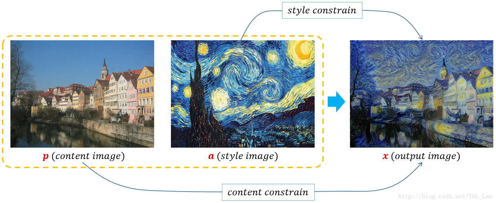

# Neural style transfer 图片风格迁移
> If you have interesting ideas or data, please contact me quickly at wangzichaochaochao@gmail.com .

This repository uses deep learning to compose one image in the style of another image (ever wish you could paint like Picasso or Van Gogh?). This is known as neural style transfer and the technique is outlined in [A Neural Algorithm of Artistic Style (Gatys et al.)](https://arxiv.org/abs/1508.06576).

Neural style transfer is an optimization technique used to take two images—a content image and a style reference image (such as an artwork by a famous painter)—and blend them together so the output image looks like the content image, but “painted” in the style of the style reference image.

This is implemented by optimizing the output image to match the content statistics of the content image and the style statistics of the style reference image. These statistics are extracted from the images using a convolutional network.

这个资源使用深度学习给一张图片加上另一张图片的风格（你希望你可以画像毕加索或梵高？）。 这被称为神经风格转移，并且该技术在 [A Neural Algorithm of Artistic Style (Gatys et al.)](https://arxiv.org/abs/1508.06576) 中概述。

神经风格转移是一种优化技术，用于将A图像内容和B图像的风格（如着名画家的作品混合在一起，使输出图像看起来像A图像内容，但具有B图像的风格。

这是通过优化输出图像来近似内容图像的内容和样式参考图像的样式来实现的。使用卷积网络从图像中提取这些统计数据。

**House Content Picture A+ Van Gogh Style Picture B=Van Gogh Style House Picture**
**房子内容图片A+梵高风格图片B=梵高风格房子图片**


**House content picture A + night style picture B = night style house picture**
**房子内容图片A+黑夜风格图片B=黑夜风格房子图片**


[点击了解更多 Click to learn more](https://yuanxiaosc.github.io/categories/%E8%AE%BA%E6%96%87/%E5%9B%BE%E5%83%8F%E9%A3%8E%E6%A0%BC%E8%BF%81%E7%A7%BB/)


### Require

+ python 3+, e.g. python==3.6
+ tensorflow version 2, e.g. tensorflow==2.0.0-beta1

### Use Model

```python
python train_and_inference_by_image_transfer_model.py
```

Of course, you can use your own image to change the contents of the following two lines of code.

```python
train_and_inference_by_image_transfer_model.py 112~113 lines code

content_path = ...your content image file path
style_path = ...your style image file path
```
