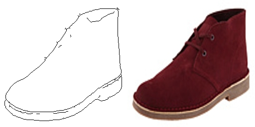

# Pix2Pix (Image-to-Image)
> If you have interesting ideas or data, please contact me quickly at wangzichaochaochao@gmail.com .

[Image-to-Image Translation with Conditional Adversarial Networks](https://arxiv.org/abs/1611.07004) is a general-purpose technique used by Berkeley University to use conditional confrontation networks as image-to-image conversion problems. This technique is generally abbreviated as pix2pix or Image-to-Image. DeepNude program mainly uses this Image-to-Image(Pix2Pix) technology.

The experimental results are as follows. The Pix2Pix neural network model is used to implement the predefined tasks in the [paper](https://arxiv.org/abs/1611.07004): white stick figures to color graphics, flat houses to stereoscopic houses and aerial maps to maps.

[Image-to-Image Translation with Conditional Adversarial Networks](https://arxiv.org/abs/1611.07004) 是伯克利大学研究提出的使用条件对抗网络作为图像到图像转换问题的通用技术。该技术一般简写为为pix2pix或者Image-to-Image。DeepNude程序主要使用这种Image-to-Image（Pix2Pix）技术。

实验效果如下，使用Pix2Pix神经网络模型实现[论文](https://arxiv.org/abs/1611.07004)中预定义的任务：黑白简笔画到彩图、平面房屋到立体房屋和航拍图到地图等功能。


As shown in the above figure, the Pix2Pix neural network needs such a one-to-one correspondence (this is also a major drawback of the model). Sometimes it is difficult to collect a large number of one-to-one correspondences, so we can use [CycleGAN](https://github.com/yuanxiaosc/DeepNude-an-Image-to-Image-technology/tree/master/CycleGAN) (CycleGAN only needs two Types of pictures).

如上图所示，Pix2Pix神经网络需要这样的一一对应的图片（这也是该模型的一大缺点），有时我们很难收集到大量一一对应的图片，所以我们可以使用[CycleGAN](https://github.com/yuanxiaosc/DeepNude-an-Image-to-Image-technology/tree/master/CycleGAN)（CycleGAN只需要两种类型的图片）。

---

## 代码用法 Code usage

You can use your own data or directly use the data of a predefined task.

你可以使用自己的数据或者直接使用预定义任务的数据。

|预定义任务名称|Predefined task name|data_dir_or_predefined_task_name|
|-|-|-|
|街道标签到立体街道场景|Labels to Street Scene|cityscapes|
|房屋标签到立体房屋|Labels to Facade|facades|
|黑白到彩图|BW to color||
|航拍图到地图|Aerial to Map|maps|
|白天到黑夜|Day to Night||
|黑白简笔画到彩图|Edges to Photo|edges2handbags / edges2shoes|

```
predefined_task_name_list = ["cityscapes", "edges2handbags", "edges2shoes", "facades", "maps"]
```

### Require

+ python 3+, e.g. python==3.6
+ tensorflow version 2, e.g. tensorflow==2.0.0-beta1
+ tensorflow-datasets

### Train Model

```python
python train_conditional_adversarial_model.py data_dir_or_predefined_task_name
```

### Model Inference

```python
python inference_by_conditional_adversarial_model.py data_dir_or_predefined_task_name
```

---


## 使用自己的数据 Use your own data

Give an example 举例：

[edges2shoes_example](edges2shoes_example)

```
edges2shoes
│
│  
├─train
│      10001_AB.jpg
│      10002_AB.jpg
│      10003_AB.jpg    
│      
└─val
       100_AB.jpg
       101_AB.jpg
       102_AB.jpg
```

check image 10001_AB.jpg.



If the data folder path(edges2shoes) is /home/b418a/.keras/datasets/edges2shoes/

```
python train_image2text_model.py /home/b418a/.keras/datasets/edges2shoes/
```

> See the load function in dataset_utils.py for details.

```
def load(image_file):
    image = tf.io.read_file(image_file)
    image = tf.image.decode_jpeg(image)

    w = tf.shape(image)[1]
    w = w // 2

    input_image = image[:, :w, :]
    real_image = image[:, w:, :]

    input_image = tf.cast(input_image, tf.float32)
    real_image = tf.cast(real_image, tf.float32)

    return input_image, real_image
```
