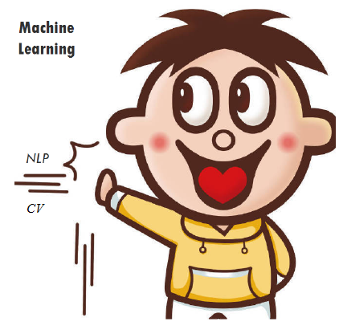
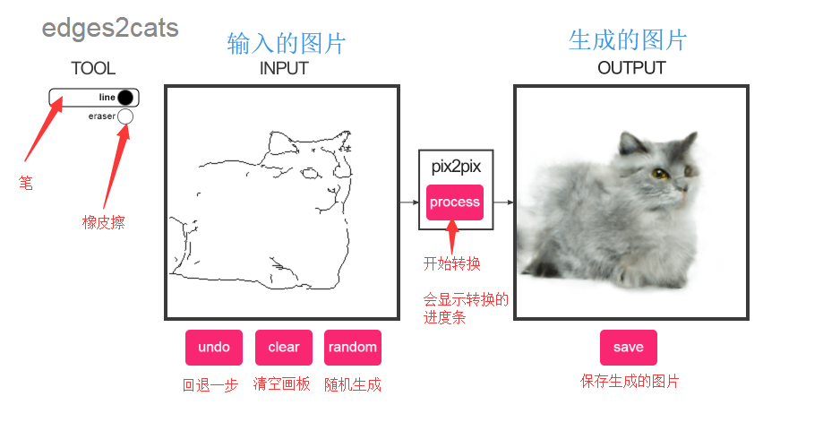
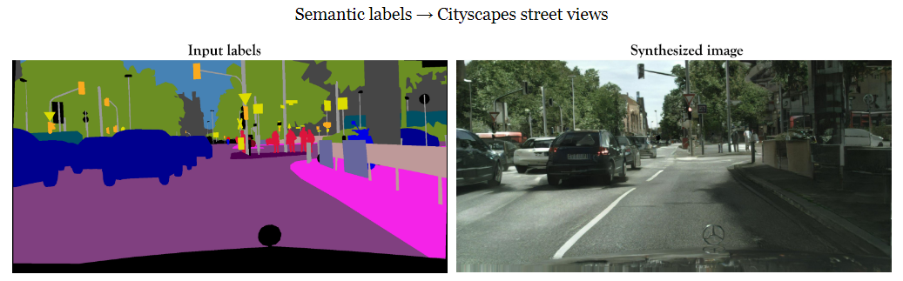
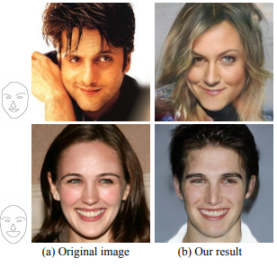
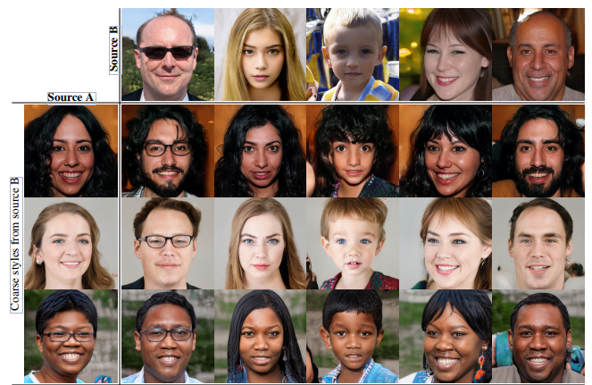
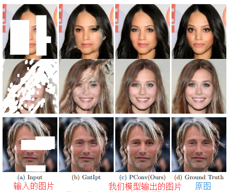

# DeepNude-an-Image-to-Image-technology

This repository contains the pix2pixHD algorithms(proposed by NVIDIA) of DeepNude, and more importantly, the general image generation theory and practice behind DeepNude.

这个仓库包含DeepNude的pix2pixHD(由英伟达提出)算法，更重要的是DeepNude背后通用的图像生成理论与实践研究。

> This resource includes the TensorFlow2 implementation of image generation models such as pix2pix, CycleGAN, DCGAN, and VAE. 本资源包含pix2pix、CycleGAN、DCGAN、VAE等图像生成模型的 [TensorFlow2](https://www.tensorflow.org/) 实现。

## What is DeepNude? 什么是 DeepNude?
DeepNude uses a slightly modified version of the [pix2pixHD](https://github.com/NVIDIA/pix2pixHD) GAN architecture, quoted from deepnude_official. pix2pixHD is a general-purpose Image2Image technology proposed by NVIDIA. Obviously, DeepNude is the wrong application of artificial intelligence technology, but it uses Image2Image technology for researchers and developers working in other fields such as fashion, film and visual effects.

DeepNude使用了一个稍微修改过的 [pix2pixHD](https://github.com/NVIDIA/pix2pixHD) GAN 架构。pix2pixHD是由NVIDIA提出的一种通用的Image2Image技术。显然，DeepNude是人工智能技术的错误应用，但它使用的Image2Image技术对于在时尚，电影和视觉效果等其他领域工作的研究人员和开发人员非常有用。

---

## Content of this resource 本资源内容

|English|中文|
|-|-|
|What is DeepNude?|什么是 DeepNude?|
|Fake Image Generation and Image-to-Image Demo |试玩Demo|
|DeepNude Algorithm|               DeepNude算法|
|Image Generation Theoretical Research|  图像生成理论研究|
|Image Generation Practice Research|     图像生成实践研究|
|Future|					                     展望未来|

---

## Fake Image Generation Demo

This section provides a fake image generation demo that you can use as you wish. They are fake images generated by StyleGAN without any copyright issues. Note: Each time you refresh the page, a new fake image will be generated, pay attention to save!

这部分提供一个试玩的假图片生成Demo，你可以随心所欲的使用它们。它们是由StyleGAN生成的假图片，没有任何版权问题。每次刷新网页都会生成新的假图像，注意保存！

+ [点击生成假人图像  Click to generate fake person image](https://thispersondoesnotexist.com/)
+ [点击生成假猫图像  Click to generate fake cat image](http://thesecatsdonotexist.com/)
+ [点击生成假老婆图像  Click to generate fake waifu image](https://www.thiswaifudoesnotexist.net/)

## Image-to-Image Demo

This section provides a demo of Image-to-Image Demo: Black and white stick figures to colorful cats, shoes, handbags. DeepNude software mainly uses Image-to-Image technology, which theoretically converts the images you enter into any image you want. You can experience Image-to-Image technology in your browser by clicking Image-to-Image Demo below.

这一部分提供一个试玩的 Image-to-Image Demo：黑白简笔画到色彩丰富的猫、鞋、手袋。DeepNude 软件主要使用了Image-to-Image技术，该技术理论上可以把你输入的图片转换成任何你想要的图片。你可以点击下方的Image-to-Image Demo在浏览器中体验Image-to-Image技术。

[Try Image-to-Image Demo](https://affinelayer.com/pixsrv/)

An example of using this demo is as follows：

In the left side box, draw a cat as you imagine, and then click the process button, you can output a model generated cat.

在左侧框中按照自己想象画一个简笔画的猫，再点击process按钮，就能输出一个模型生成的猫。

---

## :underage: DeepNude Algorithm
> DeepNude is a pornographic software that is forbidden by minors. If you are not interested in DeepNude itself, you can skip this section and see the general Image-to-Image theory and practice in the following chapters. DeepNude 是一款含有色情的软件，未成年人禁止使用。如果你对DeepNude本身不感兴趣，可以直接跳过本节，查看后面章节中通用的Image-to-Image理论与实践研究。

|Title|Content|
|-|-|
|[DeepNude_software_itself](DeepNude_software_itself)|DeepNude software usage process and evaluation of advantages and disadvantages. DeepNude 软件的使用过程和优缺点评价。|
| ~~Official DeepNude Algorithm(Based on Pytorch)~~ |官方版本DeepNude算法（基于Pytorch）|

---

## Image Generation Theoretical Research

This section describes DeepNude-related AI/Deep Learning theory (especially computer vision) research. If you like to read the paper and use the latest papers, enjoy it.

这一部分阐述DeepNude相关的人工智能/深度学习理论（特别是计算机视觉）研究，如果你喜欢阅读论文使用最新论文成果，尽情享用吧。

[Click here to systematically understand GAN](GAN_History)

### 1. Pix2Pix

+ 论文 Berkeley 2017 paper [Image-to-Image Translation with Conditional Adversarial Networks](https://arxiv.org/abs/1611.07004)
+ 主页 [Pix2Pix homepage](https://phillipi.github.io/pix2pix/)
+ 代码 code [pix2pix](https://github.com/phillipi/pix2pix)
+ Run in Google Colab [pix2pix.ipynb](https://github.com/tensorflow/docs/blob/master/site/en/r2/tutorials/generative/pix2pix.ipynb)

**效果**

[Image-to-Image Translation with Conditional Adversarial Networks](https://arxiv.org/abs/1611.07004) is a general solution for the use of conditional confrontation networks as an image-to-image conversion problem proposed by the University of Berkeley.

[Image-to-Image Translation with Conditional Adversarial Networks](https://arxiv.org/abs/1611.07004) 是伯克利大学研究提出的使用条件对抗网络作为图像到图像转换问题的通用解决方案。

### 2. Pix2PixHD
> DeepNude mainly uses this Image-to-Image(Pix2PixHD) technology.

+ 论文 NVIDIA 2018 [High-Resolution Image Synthesis and Semantic Manipulation with Conditional GANs](https://arxiv.org/abs/1711.11585)
+ 主页 [Pix2PixHD homepage](https://tcwang0509.github.io/pix2pixHD/)
+ 代码 code [pix2pixHD](https://github.com/NVIDIA/pix2pixHD)

**效果**

Get high resolution images from the semantic map. The semantic graph is a color picture. The different color blocks on the map represent different kinds of objects, such as pedestrians, cars, traffic signs, buildings, and so on. Pix2PixHD takes a semantic map as input and produces a high-resolution, realistic image. Most of the previous techniques can only produce rough, low-resolution images that don't look real. This research has produced images with a resolution of 2k by 1k, which is very close to full HD photos.

从语义图上获得高分辨率图片。语义图是一幅彩色图片，图上的不同色块代表不同种类物体，如行人、汽车、交通标志、建筑物等。Pix2PixHD将一张语义图作为输入，并由此生成了一张高分辨率的逼真的图像。之前的技术多数只能生成粗糙的低分辨率的图片，看起来也不真实。而这个研究却生成了2k乘1k分辨率的图像，已经很接近全高清的照片。

### 3. CycleGAN

+ 论文 Berkeley 2017 paper [Unpaired Image-to-Image Translation using Cycle-Consistent Adversarial Networks](https://arxiv.org/abs/1703.10593)
+ 主页 [CycleGAN homepage](https://junyanz.github.io/CycleGAN/)
+ 代码 code [CycleGAN](https://github.com/junyanz/CycleGAN)
+ Run in Google Colab [cyclegan.ipynb](https://github.com/tensorflow/docs/blob/master/site/en/r2/tutorials/generative/cyclegan.ipynb)

**效果**

CycleGAN uses a cycle consistency loss to enable training without the need for paired data. In other words, it can translate from one domain to another without a one-to-one mapping between the source and target domain. This opens up the possibility to do a lot of interesting tasks like photo-enhancement, image colorization, style transfer, etc. All you need is the source and the target dataset.

CycleGAN使用循环一致性损失函数来实现训练，而无需配对数据。换句话说，它可以从一个域转换到另一个域，而无需在源域和目标域之间进行一对一映射。这开启了执行许多有趣任务的可能性，例如照片增强，图像着色，样式传输等。您只需要源和目标数据集。

### 4. StyleGAN

+ 论文 NVIDIA 2019 paper [A Style-Based Generator Architecture for Generative Adversarial Networks](https://arxiv.org/abs/1812.04948)
+ 代码 code [stylegan](https://github.com/NVlabs/stylegan)

**效果**

Source A + Source B (Style) = ?

StyleGAN can not only generate fake images source A and source B, but also combine the content of source A and source B from different strengths, as shown in the following table.

StyleGAN 不仅可以生成假的图片source A 和 source B，还可以结合从不同的力度上结合source A的内容和 source B的样式，具体说明如下表。

|Style 等级（源自 Source B）|Source A|Source B|
|-|-|-|
|高等级（粗略）|所有颜色（眼睛，头发，光线）和细节面部特征来自Source A|继承Source B高级的面部特征，如姿势、一般的发型、脸部形状和眼镜|
|中等级|姿势、一般的面部形状和眼镜来自Source A|继承Source B中级的面部特征 ，如发型，张开/闭着的眼睛|
|高等级（细微）|主要面部内容来自Source A|继承Source B高级面部特征，如颜色方案和微观结构|

### 5. Image Inpainting 图像修复

+ 论文 NVIDIA 2018 paper [Image Inpainting for Irregular Holes Using Partial Convolutions](https://arxiv.org/abs/1804.07723) and [Partial Convolution based Padding](https://arxiv.org/abs/1811.11718).
+ 代码 Paper code [partialconv](https://github.com/NVIDIA/partialconv)。

**效果**

In the image interface of [Image_Inpainting(NVIDIA_2018).mp4](https://github.com/yuanxiaosc/DeepNude-an-Image-to-Image-technology/raw/master/paper_images/Image_Inpainting(NVIDIA_2018).mp4) video, you only need to use tools to simply smear the unwanted content in the image. Even if the shape is very irregular, NVIDIA's model can “restore” the image with very realistic The picture fills the smeared blank. It can be described as a one-click P picture, and "no ps traces." The study was based on a team from Nvidia's Guilin Liu et al. who published a deep learning method that could edit images or reconstruct corrupted images, even if the images were worn or lost pixels. This is the current 2018 state-of-the-art approach.

在 [Image_Inpainting(NVIDIA_2018).mp4](https://github.com/yuanxiaosc/DeepNude-an-Image-to-Image-technology/raw/master/paper_images/Image_Inpainting(NVIDIA_2018).mp4) 视频中左侧的操作界面，只需用工具将图像中不需要的内容简单涂抹掉，哪怕形状很不规则，NVIDIA的模型能够将图像“复原”，用非常逼真的画面填补被涂抹的空白。可谓是一键P图，而且“毫无ps痕迹”。该研究来自Nvidia的Guilin Liu等人的团队，他们发布了一种可以编辑图像或重建已损坏图像的深度学习方法，即使图像穿了个洞或丢失了像素。这是目前2018 state-of-the-art的方法。

---

## Image Generation Practice Research
> These models are based on the latest implementation of TensorFlow2.

This section explains DeepNude-related AI/Deep Learning (especially computer vision) code practices, and if you like to experiment, enjoy them.

这一部分阐述DeepNude相关的人工智能/深度学习（特别是计算机视觉）代码实践，如果你喜欢动手做实验，尽情享用它们。

### 1. Pix2Pix

Use the Pix2Pix model (Conditional Adversarial Networks) to implement black and white stick figures to color graphics, flat houses to stereoscopic houses and aerial maps to maps.

使用Pix2Pix模型（Conditional Adversarial Networks）实现黑白简笔画到彩图、平面房屋到立体房屋和航拍图到地图等功能。

[Click Start Experience 1](Pix2Pix)

### 2. Pix2PixHD

Under development... First you can use the [official implementation](https://github.com/NVIDIA/pix2pixHD)

### 3. CycleGAN

The CycleGAN neural network model is used to realize the four functions of photo style conversion, photo effect enhancement, landscape season change, and object conversion.

使用CycleGAN神经网络模型实现照片风格转换、照片效果增强、照片中风景季节变换、物体转换四大功能。

[Click Start Experience 3](CycleGAN)

### 4. DCGAN

DCGAN is used to achieve random number to image generation tasks, such as face generation. 使用DCGAN来实现随机数到图片生成任务，比如人脸生成。

[Click Start Experience 4](DCGAN)

### 5. Variational Autoencoder (VAE)
VAE is used to achieve random number to image generation tasks, such as face generation. 使用VAE来实现随机数到图片生成任务，比如人脸生成。

[Click Start Experience 5](Variational_Autoencoder)

### 6. Neural style transfer
Use VGG19 to achieve image style migration effects, such as photo changes to oil paintings and comics. 使用VGG19来实现图片风格迁移效果，比如照片变油画、漫画。

[Click Start Experience 6](Neural_style_transfer)

..........................................................................

如果你是使用[PaddlePaddle](https://github.com/PaddlePaddle/Paddle)的用户，可以参考以上模型的Paddle版本 [图像生成模型库 PaddleGAN](https://github.com/PaddlePaddle/models/tree/develop/PaddleCV/PaddleGAN)。

---

## Future

[Click read more...](Future)
