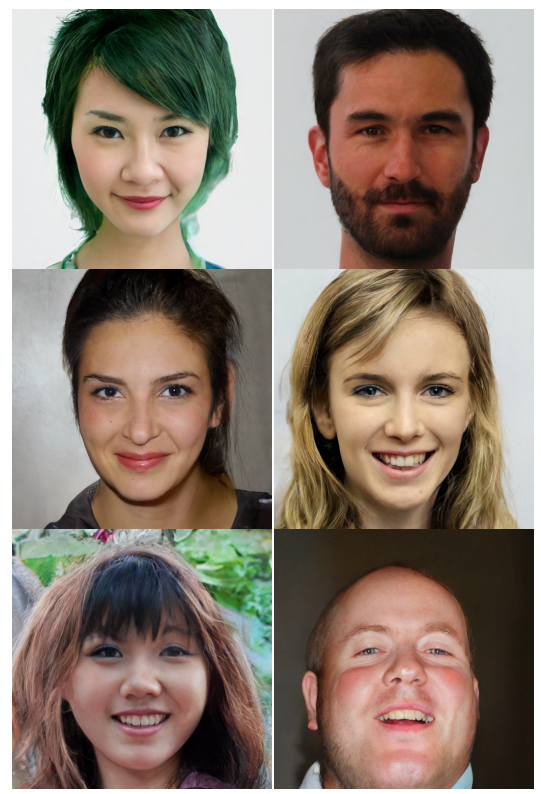

# Variational Autoencoder(VAE)
> If you have interesting ideas or data, please contact me quickly at wangzichaochaochao@gmail.com .


Variational autoencoders are interesting generative models, which combine
ideas from deep learning with statistical inference. They can be used to learn
a low dimensional representation Z of high dimensional data X such as
images (of e.g. faces). In contrast to standard auto encoders, X and Z are
random variables. It’s therefore possible to sample X from the distribution P(X|
Z), thus creating e.g. images of faces, MNIST Digits, or speech.

Here we use VAE to realize face generation.

变分自动编码器是有趣的生成模型，它将深度学习和统计推断的思想结合起来。 它们可用于学习高维数据X的低维表示Z，例如图像（例如面部）。 与标准自动编码器相比，X和Z是随机变量。 因此，可以从分布P（X | Z）中对X进行采样，从而产生例如 面部图像，MNIST数字或语音。

这儿使用 VAE 来实现人脸生成功能。


---

## 代码用法 Code usage

You can use your own data or directly use the data of a predefined task.

你可以使用自己的数据或者直接使用预定义任务的数据。

CelebFaces Attributes (CelebA) Dataset https://www.kaggle.com/jessicali9530/celeba-dataset/home

### Require

+ python 3+, e.g. python==3.6
+ tensorflow version 2, e.g. tensorflow==2.0.0-beta1
+ tensorflow-datasets

### Train Model

```python
python train_vae_model.py
```

### Model Inference

```python
python inference_by_vae_model.py
```

## Relevant Reading of Variational Autoencoder

+ [变分自编码器（望江人工智库）](https://yuanxiaosc.github.io/categories/深度学习/变分自编码器/)
+ [Introduction to variational autoencoders](https://tensorchiefs.github.io/bbs/files/vae.pdf)


## VQ-VAE-2
The above simple Convolutional Variational Autoencoder can only generate blurred face images. If you want to get better results, we recommend VQ-VAE-2, which can generate the following high-definition images.

上述简单的卷积变分自编码器只能生成模糊的人脸图片，如果你想获得更好的效果，推荐使用VQ-VAE-2，它能生成如下的高清图像。



+ Paper [Generating Diverse High-Fidelity Images with VQ-VAE-2](https://arxiv.org/abs/1906.00446)
+ Code [vq-vae-2-pytorch](https://github.com/rosinality/vq-vae-2-pytorch)
